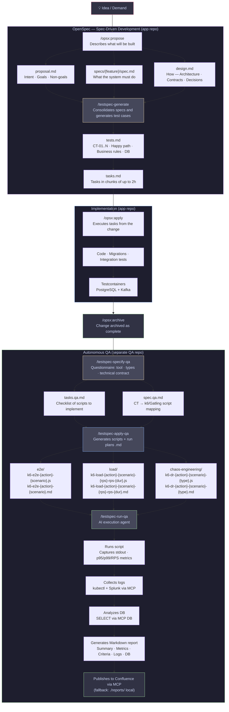

# @analizza-ai/testspec

[](https://www.npmjs.com/package/@analizza-ai/testspec)
[](https://github.com/analizza-ai/testspec/actions/workflows/ci.yml)
[](./LICENSE)
[](./package.json)

**Spec Driven Testing — the test layer for SDD**

> `Spec Driven Development` — Unit tests · Integration tests · Testcontainers
> `Spec Driven Testing` — End-to-end · Load · Chaos Engineering · UI · Exploratory

testspec installs 4 Claude Code slash commands that cover the full SDT lifecycle — from developer tests to QA automation. Specs are the single source of truth. Tests are derived, never invented.

---

## Test pyramid


```
┌─────────────────────────────────────────────────┐
│              CHAOS ENGINEERING                  │  ← /testspec-run-qa
│         (resilience · DR · fault injection)     │
├─────────────────────────────────────────────────┤
│               QA LAYER                          │  ← /testspec-specify-qa → /testspec-apply-qa
│     end-to-end tests · load tests (k6/Gatling)  │
├─────────────────────────────────────────────────┤
│             DEVELOPER LAYER                     │  ← /testspec-generate
│   unit tests · integration tests (Testcontainers│
│   PostgreSQL · Kafka · etc.)                    │
└─────────────────────────────────────────────────┘
         All layers driven by: tests.md
         tests.md driven by: spec.md + proposal.md + design.md
```

---

## Full development + test flow



---

## Quick start

```bash
# install globally
npm install -g @analizza-ai/testspec

# in your project root (must have openspec/ or similar)
testspec init       # detects SDD framework, selects AI agent, writes config
testspec generate   # reads specs → writes tests.md + stubs
testspec validate --results test-results.json
testspec report
```

---

## Skills

`testspec init` installs these 4 slash commands into your project's `.claude/commands/`:

| # | Skill | Layer | What it does |
|---|-------|-------|--------------|
| 1 | `/testspec-generate` | Developer | Consolidates all `spec.md` files for the feature and generates `tests.md` — a technology-agnostic document with numbered test cases (CT-01..N), acceptance criteria, DB validations, and out-of-scope boundaries |
| 2 | `/testspec-specify-qa` | QA | Creates `testspec/` and `instructions.md` automatically if missing. Reads `tests.md` via GitHub MCP, runs a questionnaire (tool, test types, technical contract JSON) and generates `spec.qa.md` + `tasks.qa.md` + folder structure |
| 3 | `/testspec-apply-qa` | QA | Implements k6/Gatling scripts from `tasks.qa.md` using `spec.qa.md` as the contract. Auto-generates a `.md` run plan alongside each script. Marks tasks `[x]` immediately after each pair is created |
| 4 | `/testspec-run-qa` | QA / Chaos | AI agent: reads the run plan `.md`, executes the script, collects logs (kubectl + Splunk via MCP), queries the DB via MCP, generates a Markdown report, and publishes to Confluence. Never cancels the suite on failure — reports everything and continues |

---

## How it works

```
Spec artifacts (proposal.md · design.md · specs/**/*.md · tasks.md)
    ↓
testspec generate  (/testspec-generate)
    ↓
SpecContext (scenarios, rules, contracts, dbAssertions)
    ↓
Agent prompt (printed to chat or sent via --api)
    ↓
tests.md  (CT-01..N)
    ↓
Unit stubs + Integration stubs (Testcontainers)
    ↓
QA repo reads tests.md via GitHub MCP
    ↓  /testspec-specify-qa
spec.qa.md + tasks.qa.md
    ↓  /testspec-apply-qa
k6 / Gatling scripts  ·  run plans .md
    ↓  /testspec-run-qa
Execution · Metrics · Logs · Report → Confluence
```

---

## OpenSpec structure (app repo)

```
openspec/
├── config.yaml                          # stack, conventions and global rules
├── specs/                               # reusable specs (global)
└── changes/
    ├── archive/                         # completed changes (/opsx:archive)
    └── {change-name}/
        ├── proposal.md                  # context, goals, non-goals
        ├── design.md                    # architecture, contracts, decisions
        ├── specs/
        │   └── {feature}/
        │       └── spec.md              # behaviour specification
        ├── tests.md                     # test cases generated by /testspec-generate
        └── tasks.md                     # tasks ready for /opsx:apply
```

## QA repo structure

```
testspec/
├── instructions.md              # app_repo (GitHub owner/repo), MCPs, QA project standards
├── current-feature.md           # feature in focus for the current session (written by skills)
└── {feature-name}/
    ├── spec.qa.md               # technical contract: request · response · rules · CT → script mapping
    └── tasks.qa.md              # checklist [ ] / [x] of scripts to implement

src/test/features/
└── {feature-name}/
    ├── e2e/
    │   ├── {tool}-e2e-{action}-{scenario}.js    # functional script — 1 per CT
    │   └── {tool}-e2e-{action}-{scenario}.md    # run plan — read by /testspec-run-qa
    ├── load/
    │   ├── {tool}-load-{action}-{scenario}-{rps}-rps-{dur}.js
    │   └── {tool}-load-{action}-{scenario}-{rps}-rps-{dur}.md
    └── chaos-engineering/
        ├── {tool}-dr-{action}-{scenario}-{type}.js
        └── {tool}-dr-{action}-{scenario}-{type}.md

reports/
└── {feature-name}/
    └── {script}-{YYYY-MM-DD-HHmm}.md   # report generated by /testspec-run-qa
                                          # (fallback when Confluence unavailable)
```

---

## tests.md format

```yaml
---
feature: Item Creation
change: item-creation
generated: 2026-05-25T10:00:00.000Z
sdd: openspec
sdt: 0.1.0
stack: { lang: node, db: postgresql }
qa-repo: analizza-ai/qa
---

# Tests — Item Creation

## Scope
## Out of scope

## Test cases

### CT-01 — Create item with valid payload

| Field               | Value                              |
|---------------------|------------------------------------|
| Type                | integration                        |
| Layer               | developer                          |
| Precondition        | User is authenticated              |
| Input               | POST /api/items { name: "x" }      |
| Expected output     | 201 Created { id: 1 }              |
| DB validation       | SELECT id FROM items WHERE id = 1  |
| Acceptance criteria | · item persisted · id returned     |

## Load profile hints
## Chaos scenarios
```

---

## Supported SDD frameworks

| Framework | Status |
|-----------|--------|
| OpenSpec (`@fission-ai/openspec`) | ✅ v1 |
| SpecKit | planned |
| BMAD | planned |
| Kiro (AWS) | planned |
| Custom | planned |

## Supported AI agents

| Agent | Status |
|-------|--------|
| Claude Code | ✅ print-to-chat + `--api` |
| GitHub Copilot | ✅ print-to-chat |

## Supported unit test frameworks

| Framework | Status |
|-----------|--------|
| Vitest | ✅ |
| Jest | ✅ |
| Pytest | ✅ |
| JUnit | ✅ |

## Supported integration runtimes

| Runtime | Status |
|---------|--------|
| Testcontainers + PostgreSQL | ✅ |
| Testcontainers + PostgreSQL + Kafka | ✅ |
| Testcontainers + Spring Boot + Kafka | ✅ |

---

## Configuration

`testspec.config.json` in your project root:

```json
{
  "sdd": "openspec",
  "agent": "claude",
  "unitFramework": "vitest",
  "stubs": { "unit": true, "integration": true },
  "loadHints": true,
  "chaosHints": true,
  "qaRepo": "your-org/qa-repo"
}
```

---

## CI/CD

This package is published to npmjs automatically via GitHub Actions on every `v*` tag.

| Workflow | Trigger | What it does |
|----------|---------|--------------|
| `ci.yml` | Push / PR to `main` | Lint + test on Node 20 and 22 |
| `release.yml` | Manual (`workflow_dispatch`) | Bumps version, commits, pushes tag |
| `publish.yml` | Tag `v*` push or manual | Publishes to npmjs with provenance |

To release a new version: **GitHub → Actions → Release → Run workflow → pick `patch` / `minor` / `major`**.

---

## Adapter extension guide

See [docs/adapters-sdd.md](docs/adapters-sdd.md) to add a custom SDD framework adapter.

---

## Contributing

See [CONTRIBUTING.md](CONTRIBUTING.md). Issues and PRs welcome.

---

## License

MIT © Diego Lirio
